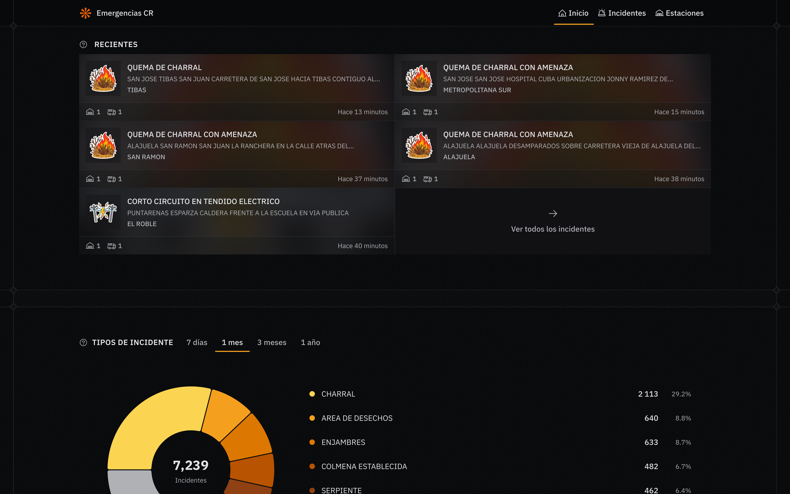
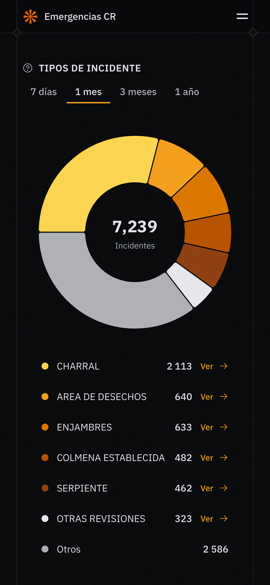
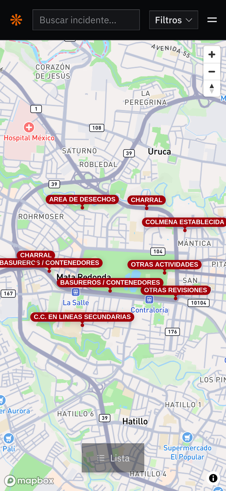
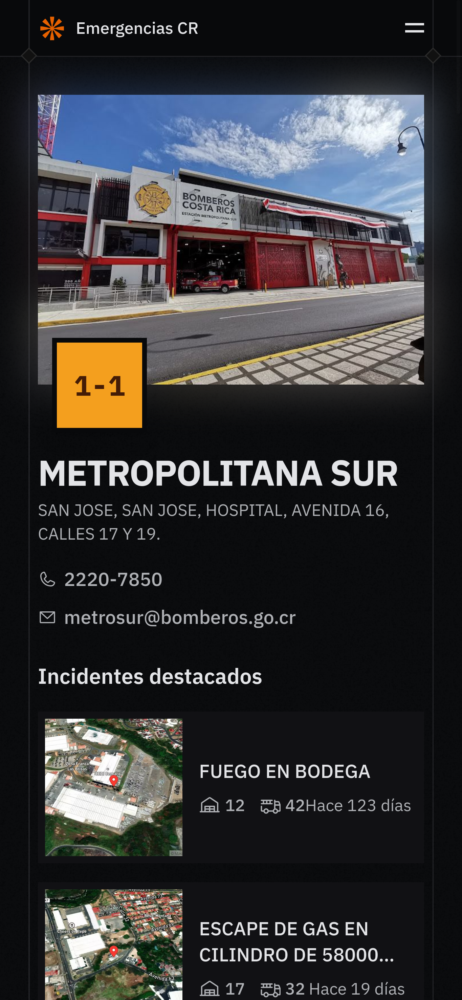

<p align="center">
  
</p>

Emergencias CR brings together real-time details, analysis, and statistics about emergencies attended by Bomberos de Costa Rica.

<p align="center">
  <a href="https://emergencias.alech.dev">Live site</a>
  ·
  <a href="https://emergencias.alech.dev/api">API reference</a>
</p>

## Screenshots

<p align="center">
  
</p>

<p align="center">
  
  
</p>

<p align="center">
  
  
  
</p>

## What's Included

- `apps/api`: Hono API.
- `apps/frontend`: TanStack Start frontend.
- `apps/sync-v2`: BullMQ-based sync service.
- `apps/sync`: legacy sync service.
- `packages/*`: shared modules for DB, libraries, and domain logic.

## Development

Install dependencies:

```bash
bun install
```

Run API and frontend:

```bash
bun dev
```

Run everything, including sync:

```bash
bun dev:all
```

Run individual services:

```bash
bun dev:api
bun dev:frontend
bun dev:sync
```

## Verification

Lint:

```bash
bun lint:check
```

Formatting:

```bash
bun format:check
```
